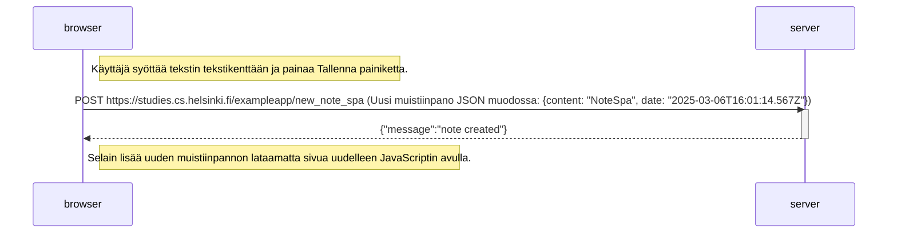

```mermaid
sequenceDiagram
participant browser
participant server

Note right of browser: Käyttäjä syöttää tekstin tekstikenttään ja painaa Tallenna painiketta.
browser->>server: POST https://studies.cs.helsinki.fi/exampleapp/new_note_spa (Uusi muistiinpano JSON muodossa: {content: "NoteSpa", date: "2025-03-06T16:01:14.567Z"})
activate server
server-->>browser: {"message":"note created"}
deactivate server

Note right of browser: Selain lisää uuden muistiinpannon lataamatta sivua uudelleen JavaScriptin avulla.
```
