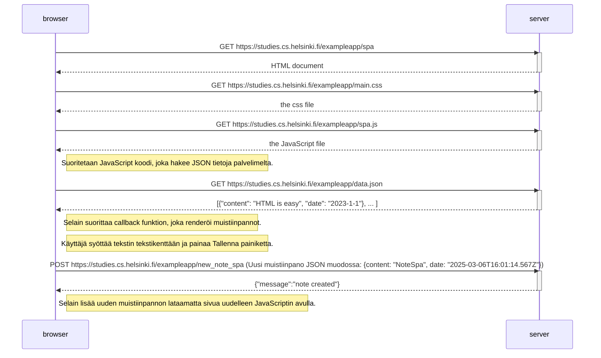

```mermaid
sequenceDiagram
participant browser
participant server

browser->>server: GET https://studies.cs.helsinki.fi/exampleapp/spa
activate server
server-->>browser: HTML document
deactivate server

browser->>server: GET https://studies.cs.helsinki.fi/exampleapp/main.css
activate server
server-->>browser: the css file
deactivate server

browser->>server: GET https://studies.cs.helsinki.fi/exampleapp/spa.js
activate server
server-->>browser: the JavaScript file
deactivate server

Note right of browser: Suoritetaan JavaScript koodi, joka hakee JSON tietoja palvelimelta.
browser->>server: GET https://studies.cs.helsinki.fi/exampleapp/data.json
activate server
server-->>browser: [{"content": "HTML is easy", "date": "2023-1-1"}, ... ]
deactivate server

Note right of browser: Selain suorittaa callback funktion, joka renderöi muistiinpannot.

Note right of browser: Käyttäjä syöttää tekstin tekstikenttään ja painaa Tallenna painiketta.
browser->>server: POST https://studies.cs.helsinki.fi/exampleapp/new_note_spa (Uusi muistiinpano JSON muodossa: {content: "NoteSpa", date: "2025-03-06T16:01:14.567Z"})
activate server
server-->>browser: {"message":"note created"}
deactivate server

Note right of browser: Selain lisää uuden muistiinpannon lataamatta sivua uudelleen JavaScriptin avulla.
```
